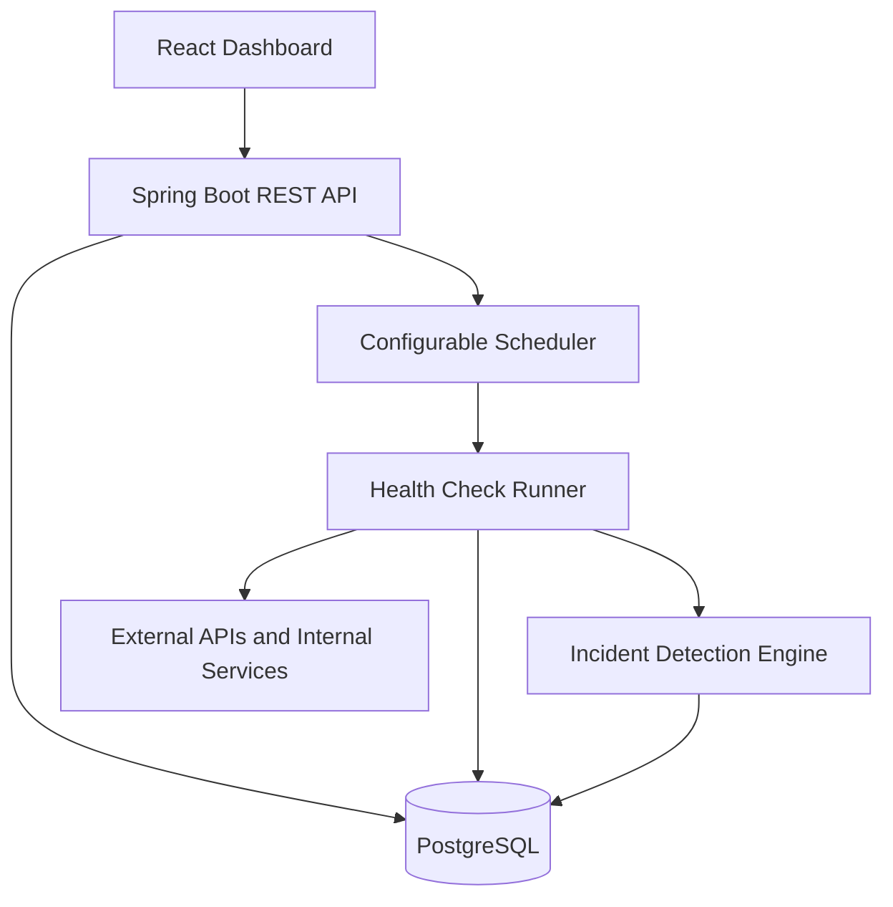

# APIWatch

APIWatch is a production-style API monitoring and incident management platform. It runs scheduled health checks against registered services, records uptime and latency history in PostgreSQL, detects repeated failures, opens incidents automatically, and resolves them when a service recovers.

## Why This Project Exists

Operations teams need a fast answer to four questions: what is failing, when it started, whether it is slow or unavailable, and whether it recovered. APIWatch provides that operational view through a Spring Boot REST API and a React dashboard.

## Features

- Service registration and configuration through REST endpoints and the dashboard
- Scheduled and manually triggered HTTP health checks
- Async scheduled monitoring workers with database leases to avoid duplicate checks
- `UP`, `SLOW`, `DOWN`, and `UNKNOWN` service states
- Dedicated `RATE_LIMITED` state with retry metadata and automatic check pauses
- Failure diagnostics for HTTP, timeout, DNS, connection, and network errors
- Encrypted Bearer tokens, API keys, and custom request headers
- Masked credential metadata in API responses and the dashboard
- Per-service check intervals and pause/resume controls
- Expected HTTP status ranges and optional response-body validation
- Configurable timeout and failure threshold
- Automatic incident creation after consecutive failures
- Automatic and manual incident resolution
- Encrypted incident webhook configuration with delivery cooldowns
- Notifications for incident open and resolution events
- HTTP Basic application authentication with administrator and viewer roles
- SSRF protection for monitored URLs and notification webhooks
- Private-network blocking with an explicit hostname allowlist
- Uptime, average latency, P95 latency, and failure metrics
- Paginated service, health-check, and incident history endpoints
- Configurable retention cleanup for checks, resolved incidents, and notifications
- PostgreSQL persistence with Flyway migrations
- Responsive React dashboard with charts and filtering
- Docker Compose full-stack environment
- Backend and frontend GitHub Actions workflows
- Opt-in demo data and local mock endpoints

## Tech Stack

| Layer | Technology |
| --- | --- |
| Backend | Java 21, Spring Boot 3.5, Spring Web, WebClient, Spring Data JPA |
| Database | PostgreSQL 16, Flyway |
| Frontend | React 19, TypeScript, Vite, Tailwind CSS, Axios, Recharts |
| Testing | JUnit 5, Mockito, Spring MockMvc, ESLint, TypeScript |
| Delivery | Docker, Docker Compose, GitHub Actions |

## Architecture



## Repository Layout

```text
apiwatch-backend/   Spring Boot API, scheduler, migrations, and tests
apiwatch-frontend/  React dashboard
.github/workflows/  Backend and frontend CI
docker-compose.yml  PostgreSQL, backend, and frontend
```

## Quick Start With Docker

Requirements: Docker with Compose support.

```bash
cp .env.example .env
docker compose up --build
```

`APIWATCH_ENCRYPTION_KEY` must be a Base64-encoded 32-byte key. The example
contains a development-only value; replace it before deploying APIWatch.

Generate a production key with:

```bash
openssl rand -base64 32
```

Open:

- Dashboard: `http://localhost:5173`
- REST API: `http://localhost:8080/api`
- Healthy mock: `http://localhost:8080/api/mock/healthy`

Sign in with the administrator or viewer credentials configured in `.env`.
Replace both example passwords before exposing APIWatch outside local development.
On startup, APIWatch stores these bootstrap users in the database with BCrypt
password hashes. Updating the environment values updates the bootstrap users on
the next application start.

Compose enables demo seeding by default. It registers healthy, slow, failing, GitHub, and JSONPlaceholder services. The scheduler starts checking them after 15 seconds.

Scheduled checks are dispatched to a bounded worker pool. Tune
`APIWATCH_SCHEDULER_WORKER_POOL_SIZE`, `APIWATCH_SCHEDULER_QUEUE_CAPACITY`,
`APIWATCH_SCHEDULER_LEASE_SECONDS`, and optional
`APIWATCH_SCHEDULER_INSTANCE_ID` when running larger service inventories or
multiple backend replicas.

Stop the stack:

```bash
docker compose down
```

Remove containers and PostgreSQL data:

```bash
docker compose down -v
```

## Local Development

Start only PostgreSQL:

```bash
docker compose up -d postgres
```

Run the backend:

```bash
cd apiwatch-backend
mvn spring-boot:run
```

Run the frontend in another terminal:

```bash
cd apiwatch-frontend
npm install
npm run dev
```

For a frontend-only preview, create `apiwatch-frontend/.env.local`:

```env
VITE_DEMO_MODE=true
```

## API Examples

Register a service:

```bash
curl -X POST http://localhost:8080/api/services \
  -u "$APIWATCH_ADMIN_USERNAME:$APIWATCH_ADMIN_PASSWORD" \
  -H "Content-Type: application/json" \
  -d '{
    "name": "Payment Service",
    "url": "https://example.com/health",
    "ownerName": "Finance Ops",
    "teamName": "Platform",
    "tags": ["payments", "critical"],
    "method": "GET",
    "expectedStatusMin": 200,
    "expectedStatusMax": 299,
    "timeoutMs": 2000,
    "checkIntervalSeconds": 60,
    "responseBodyContains": "\"status\":\"ok\"",
    "failureThreshold": 3,
    "active": true,
    "authType": "BEARER",
    "authValue": "replace-with-a-token",
    "customHeaders": {
      "X-Tenant-ID": "customer-7"
    }
  }'
```

Credential values are encrypted at rest and are never included in service
responses. On update, omit the values to keep existing credentials, provide new
values to replace them, or set `clearAuthSecret` to `true` to remove stored
authentication.

Useful endpoints:

| Method | Endpoint | Purpose |
| --- | --- | --- |
| `POST` | `/api/services` | Register a service |
| `GET` | `/api/auth/me` | Return the authenticated user and role |
| `GET` | `/api/services?page=0&size=20&query=payments&active=true&sort=team&direction=asc` | List, search, filter, and sort services with current state |
| `PUT` | `/api/services/{id}` | Update monitoring configuration |
| `PATCH` | `/api/services/{id}/active` | Pause or resume scheduled checks |
| `DELETE` | `/api/services/{id}` | Delete a service and its history |
| `POST` | `/api/services/{id}/check` | Trigger a health check |
| `GET` | `/api/services/{id}/health-checks?page=0&size=20` | Get recent checks |
| `GET` | `/api/services/{id}/metrics?windowHours=24` | Get service metrics |
| `GET` | `/api/incidents?status=ACTIVE&page=0&size=20` | List or filter incidents |
| `PATCH` | `/api/incidents/{id}/resolve` | Resolve an incident |
| `GET` | `/api/notification-settings` | Get masked webhook configuration |
| `PUT` | `/api/notification-settings` | Configure webhook delivery and cooldown |
| `GET` | `/api/notification-settings/deliveries` | Review recent delivery attempts |
| `GET` | `/api/audit-logs?page=0&size=20` | Review admin audit events |
| `GET` | `/api/dashboard/summary` | Get platform summary metrics |

## Data Model

- `services`: endpoint configuration and failure policy
- `health_checks`: immutable check result history
- `incidents`: active and resolved outage records
- `app_users`: BCrypt-hashed admin and viewer accounts
- `audit_logs`: admin mutation history for service, incident, and notification changes

Indexes support recent health-check lookups, incident filtering, and lease
expiry scans. A partial unique index prevents duplicate active incidents for the
same service.

Paged endpoints return `content`, `page`, `size`, `totalElements`, and
`totalPages`. Page indexes start at zero and page size is capped at 100.

History cleanup runs daily at 02:30 by default. Configure
`APIWATCH_RETENTION_HEALTH_CHECK_DAYS`, `APIWATCH_RETENTION_INCIDENT_DAYS`,
`APIWATCH_RETENTION_NOTIFICATION_DAYS`, and `APIWATCH_RETENTION_CRON`, or set
`APIWATCH_RETENTION_ENABLED=false` to disable cleanup.

## Incident Rules

1. Every completed request is stored as a health check.
2. A status inside the configured range and within the latency threshold is `UP`.
3. A matching status beyond the threshold is `SLOW`.
4. Network errors, timeouts, unexpected statuses, and body validation failures are `DOWN`.
5. HTTP `429`, or `403` with an exhausted rate-limit header, is `RATE_LIMITED`.
6. Rate-limited services pause until `Retry-After` or provider reset metadata allows a retry.
7. The configured number of consecutive `DOWN` checks creates one active incident.
8. A later `UP` check resolves the active incident and records its duration.
9. Enabled webhooks receive structured JSON when incidents open or resolve.
10. Repeated events for the same service are suppressed during the configured cooldown.

Webhook URLs are encrypted with `APIWATCH_ENCRYPTION_KEY` and never returned by
the API. Delivery attempts record success, failure, HTTP status, and cooldown
suppression for operational review.

## Security

All `/api` endpoints require HTTP Basic authentication except local mock
endpoints. `VIEWER` accounts can read monitoring data. `ADMIN` accounts can
create, edit, delete, check, pause, resolve, and configure notifications.
Deploy behind HTTPS because Basic credentials accompany every API request.

Outbound monitored URLs and webhooks are checked when saved and immediately
before use. Loopback, private, link-local, multicast, carrier-grade NAT, and
other internal addresses are blocked. Keep `APIWATCH_BLOCK_PRIVATE_TARGETS=true`
in production. Add required internal hostnames to
`APIWATCH_PRIVATE_TARGET_ALLOWLIST` as a comma-separated exact or `*.domain`
allowlist. Redirect following is disabled to prevent redirect-based SSRF.

## Testing

Backend:

```bash
cd apiwatch-backend
mvn test
```

Frontend:

```bash
cd apiwatch-frontend
npm test
npm run lint
npm run build
```

## CI/CD

The GitHub Actions pipeline in `.github/workflows/ci-cd.yml` runs on pull requests,
pushes to `main`, and version tags such as `v1.0.0`.

Pipeline jobs:

- Backend: sets up Java 21 and runs `mvn -B clean verify`
- Frontend: sets up Node.js 22, runs `npm ci`, `npm run lint`, `npm test`, and `npm run build`
- Docker: builds backend and frontend Docker images after tests pass
- CD: publishes images to GitHub Container Registry on pushes to `main` and tags

Published image names:

- `ghcr.io/<owner>/apiwatch-backend`
- `ghcr.io/<owner>/apiwatch-frontend`
