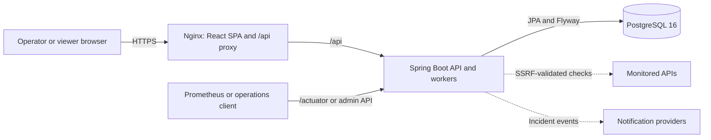

# APIWatch

[](https://github.com/hrtahsin/APIWatch/actions/workflows/ci-cd.yml)
[](https://github.com/hrtahsin/APIWatch/actions/workflows/codeql.yml)


APIWatch is a self-hosted API monitoring and incident-management platform. It schedules HTTP health checks, retains uptime and latency telemetry, detects failures, manages incidents, and delivers notifications through an operational React dashboard.

> **Current state — 2 August 2026:** the hardened `0.1.0` core is complete enough for a controlled, single-organization deployment and is a sound foundation for APIWatch Intelligence. The AI layer is designed but **not implemented**. Enterprise identity, tenant isolation, managed orchestration, and production-scale validation remain outside the current release.

[Read the audited project status and Intelligence blueprint](docs/project-status-and-blueprint.md) · [Open the editable FigJam architecture board](https://www.figma.com/board/kvyKfGR2HGEp9SJlQT4rW9) · [Use the operations runbook](docs/operations-runbook.md)

## What APIWatch does today

| Area | Available in `0.1.0` |
| --- | --- |
| Monitoring | Scheduled and manual `GET`/`HEAD` checks, expected status ranges, body matching, independent timeout and slow thresholds |
| Diagnostics | `UP`, `SLOW`, `DOWN`, `RATE_LIMITED`, and `UNKNOWN` states with HTTP, timeout, DNS, connection, network, validation, and security-blocked failure detail |
| Incidents | Configurable consecutive-failure thresholds, one active incident per service, automatic recovery, and manual resolution |
| Notifications | Webhook, Slack, Discord, email, PagerDuty, and Opsgenie; cooldown, escalation, durable outbox, claims, idempotency, retry/backoff, and manual retry |
| Security | Database-backed Basic authentication, `ADMIN`/`VIEWER` authorization, BCrypt, encrypted secrets, SSRF controls, audit logs, and production fail-fast validation |
| Dashboard | Responsive operations UI, role-aware navigation, service and incident workflows, metrics charts, loading/empty/error states, validation, toasts, and accessible dialogs |
| Operations | PostgreSQL/Flyway, retention, liveness/readiness, Prometheus metrics, request IDs, hardened containers, backup/restore scripts, and immutable image releases |
| Quality | Backend unit/integration/PostgreSQL concurrency tests, frontend unit tests, Chromium journeys, accessibility checks, dependency review, CodeQL, SBOM, and provenance |

## Architecture

APIWatch is a modular monolith: one Spring Boot deployable contains the REST API, monitoring scheduler, incident engine, retention job, and notification workers. PostgreSQL is the durable coordination boundary. The React application is served by Nginx, which proxies same-origin `/api` traffic to the backend.


```mermaid
flowchart LR
    browser[Operator or viewer browser] -->|HTTPS| nginx[Nginx: React SPA and /api proxy]
    nginx -->|/api| backend[Spring Boot API and workers]
    ops[Prometheus or operations client] -->|/actuator or admin API| backend
    backend -->|JPA and Flyway| postgres[(PostgreSQL 16)]
    backend -.->|SSRF-validated checks| targets[Monitored APIs]
    backend -.->|Incident events| providers[Notification providers]
```

The scheduler acquires a database lease before dispatching a due service to its bounded worker pool. Check results are written before incident evaluation. Incident events enter a database outbox; notification workers atomically claim deliveries before contacting a provider. This supports multiple backend replicas without duplicate scheduled work or duplicate active incidents.

The [project status and blueprint](docs/project-status-and-blueprint.md) is the authoritative written reference for the verified data model, trust boundaries, current limitations, and proposed Intelligence integration. The [FigJam board](https://www.figma.com/board/kvyKfGR2HGEp9SJlQT4rW9) provides editable visual versions of the verified runtime and monitoring/incident flow.

## Technology

| Layer | Technology |
| --- | --- |
| Backend | Java 21, Spring Boot 3.5.16, Spring MVC, WebClient, Spring Data JPA, Spring Security |
| Data | PostgreSQL 16, Flyway migrations v1–v11 |
| Frontend | React 19, TypeScript 5.9, React Router 7, Vite 6, Tailwind CSS 4, Recharts |
| Observability | Spring Boot Actuator, Micrometer, Prometheus |
| Testing | JUnit 5, Mockito, MockMvc, Testcontainers, Vitest, Testing Library, Playwright, axe-core |
| Delivery | Docker, Docker Compose, GitHub Actions, GHCR, CodeQL, Dependabot |

## Quick start

Requirements: Docker with Compose support.

```bash
cp .env.example .env
docker compose up --build
```

Open:

- Dashboard: `http://localhost:5173`
- API: `http://localhost:8080/api`
- OpenAPI UI, administrator only: `http://localhost:8080/swagger-ui.html`
- Readiness: `http://localhost:8080/actuator/health/readiness`

Sign in with the administrator or viewer credentials configured in `.env`. The local example enables demo data and includes development-only secrets. Never deploy those values.

The default ports bind to `127.0.0.1`. Keep this setting and place a TLS reverse proxy in front of APIWatch for a deployed instance.

Stop the stack with `docker compose down`. `docker compose down -v` also deletes the PostgreSQL volume and all monitoring history.

## Production configuration

Start from the deployment template:

```bash
cp .env.production.example .env
openssl rand -base64 32
```

Replace every placeholder, select matching immutable backend/frontend `sha-*` image tags, and enable the production profile. The production validator refuses to start with malformed or known development encryption keys, unsafe bootstrap credentials, shared identities, non-HTTPS origins, demo endpoints, or localhost CORS.

Keep these production invariants:

- Terminate HTTPS before APIWatch; Basic credentials accompany every request.
- Keep `APIWATCH_BLOCK_PRIVATE_TARGETS=true`; explicitly allow only required internal hostnames.
- Keep `APIWATCH_DEMO_DATA_ENABLED=false` and `APIWATCH_ALLOW_LOCALHOST_CORS=false`.
- Store `.env` with restricted permissions and manage encryption-key rotation as a maintenance operation.
- Deploy backend and frontend from the same immutable commit tag.
- Back up PostgreSQL before upgrades and rehearse restoration away from production.

See [docs/operations-runbook.md](docs/operations-runbook.md) for deployment, upgrade, backup, restore, rollback, and incident checks.

## Authentication and authorization

APIWatch bootstraps one administrator and one viewer into PostgreSQL and stores their passwords with BCrypt.

| Role | Permissions |
| --- | --- |
| `VIEWER` | Read services, checks, metrics, incidents, dashboard state, and masked notification settings |
| `ADMIN` | Viewer permissions plus service mutations, manual checks, incident resolution, notification changes/retries, audit logs, OpenAPI, and Prometheus |

`GET /api/auth/me` returns the current identity and role. APIWatch `0.1.0` does not include OIDC/SSO, user-management screens, or tenant isolation.

## Monitoring behavior

1. The scheduler finds due active services and acquires a PostgreSQL lease.
2. A bounded worker validates the target against the SSRF policy and sends `GET` or `HEAD` with redirects disabled.
3. APIWatch records status, latency, rate-limit metadata, and bounded failure diagnostics.
4. `429`, or `403` with exhausted rate-limit metadata, becomes `RATE_LIMITED` and pauses checks until the provider permits a retry.
5. The configured number of consecutive `DOWN` checks opens one active incident.
6. A later `UP` check resolves that incident and records its duration.
7. Open/resolved events enter the notification outbox and are delivered under cooldown, escalation, claim, idempotency, and retry rules.

Response-body validation is available for `GET` and capped at 64 KiB. Credentials and custom headers are encrypted at rest, masked in API responses, and revalidated immediately before outbound requests.

## API surface

The administrator-protected OpenAPI contract at `/v3/api-docs` is the authoritative machine-readable reference.

| Method | Endpoint | Purpose |
| --- | --- | --- |
| `GET` | `/api/auth/me` | Current identity and role |
| `GET` | `/api/dashboard/summary` | Platform health and latency summary |
| `GET`, `POST` | `/api/services` | Search/list or register monitored services |
| `GET`, `PUT`, `DELETE` | `/api/services/{id}` | Read, replace, or delete a service |
| `PATCH` | `/api/services/{id}/active` | Pause or resume scheduled checks |
| `POST` | `/api/services/{id}/check` | Trigger a check immediately |
| `GET` | `/api/services/{id}/health-checks` | Paginated check history |
| `GET` | `/api/services/{id}/metrics?windowHours=24` | Uptime and latency metrics |
| `GET` | `/api/incidents` and `/api/incidents/{id}` | Search/list or read incidents |
| `PATCH` | `/api/incidents/{id}/resolve` | Resolve an active incident |
| `GET`, `PUT` | `/api/notification-settings` | Read masked or update notification settings |
| `GET` | `/api/notification-settings/deliveries` | Review delivery outcomes |
| `POST` | `/api/notification-settings/deliveries/{id}/retry` | Requeue a failed delivery |
| `GET` | `/api/audit-logs` | Read administrator mutation history |

Paged endpoints return `content`, `page`, `size`, `totalElements`, and `totalPages`. Pages are zero-based and page size is capped at 100.

Example service registration:

```bash
curl -X POST http://localhost:8080/api/services \
  -u "$APIWATCH_ADMIN_USERNAME:$APIWATCH_ADMIN_PASSWORD" \
  -H "Content-Type: application/json" \
  -d '{
    "name": "Payment Service",
    "url": "https://example.com/health",
    "method": "GET",
    "expectedStatusMin": 200,
    "expectedStatusMax": 299,
    "timeoutMs": 2000,
    "slowThresholdMs": 1200,
    "checkIntervalSeconds": 60,
    "failureThreshold": 3,
    "active": true
  }'
```

## Observability and retention

Unauthenticated probes:

- `/actuator/health/liveness`
- `/actuator/health/readiness`

Administrator-protected `/actuator/prometheus` includes HTTP telemetry and bounded-cardinality counters, gauges, and timers for monitoring outcomes, scheduler dispatch, service state, incidents, and notification deliveries.

Every response carries `X-Request-Id`; valid caller-provided identifiers are propagated into backend logs. History cleanup runs daily by default and has independent retention windows for checks, resolved incidents, and notification deliveries.

## Development and verification

For a local split-stack workflow, start PostgreSQL with `docker compose up -d postgres`, run the backend from `apiwatch-backend` with `mvn spring-boot:run`, and run the frontend from `apiwatch-frontend` with `npm install && npm run dev`. The frontend development server targets the local API; `VITE_DEMO_MODE=true` enables its isolated demo adapter for UI-only work.

Backend:

```bash
cd apiwatch-backend
mvn test
mvn verify -Ppostgres-it
```

The PostgreSQL profile applies all 11 Flyway migrations to a PostgreSQL 16 Testcontainer and exercises schema constraints, repositories, leases, and notification claims.

Frontend:

```bash
cd apiwatch-frontend
npm ci
npm run lint
npm test
npm run build
npx playwright install chromium
npm run test:e2e
```

At the audited snapshot, all quality gates pass: **85 backend tests, 9 frontend unit tests, and 6 browser acceptance tests** (100 total), plus the production frontend build and Compose configuration validation.

CI runs release-version verification, the PostgreSQL integration suite, dependency review, npm audit policy, lint, unit tests, Chromium acceptance/accessibility checks, CodeQL, and Docker builds. Successful non-PR builds publish GHCR images with SBOM and provenance; releases are governed by `VERSION` and `v<VERSION>` tags.

## Repository map

```text
apiwatch-backend/                 Spring Boot API, workers, migrations, tests
apiwatch-frontend/                React dashboard, Nginx proxy, tests
docs/operations-runbook.md        Deployment and recovery procedures
docs/project-status-and-blueprint.md  Audited status and Intelligence plan
scripts/                          Release, backup, restore, and audit helpers
.github/workflows/                CI/CD and CodeQL
docker-compose.yml                PostgreSQL, backend, frontend
VERSION                           Canonical product version
```

## Scope and next step

APIWatch `0.1.0` is deliberately a hardened monitoring core, not yet a general enterprise SaaS platform. It does not currently provide multi-tenancy, OIDC/SSO, synthetic browser or multi-step probes, an external message broker, SLO/error-budget management, managed Kubernetes/cloud infrastructure, or AI-generated insights.

The recommended next product track is APIWatch Intelligence behind an asynchronous, evidence-preserving boundary. It should consume versioned monitoring data and produce explainable insights without placing model calls in the health-check or incident-creation path. The staged plan and entry criteria are in [docs/project-status-and-blueprint.md](docs/project-status-and-blueprint.md).
