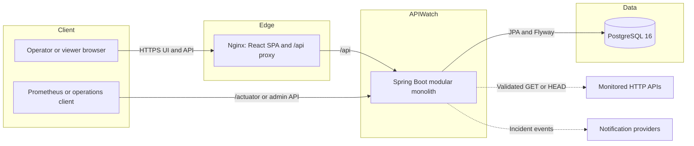
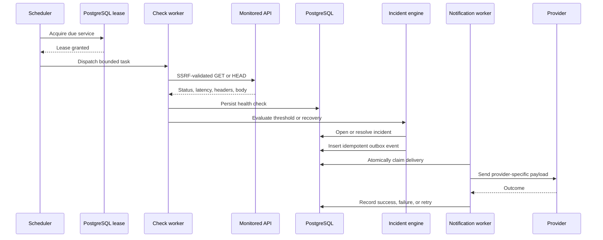
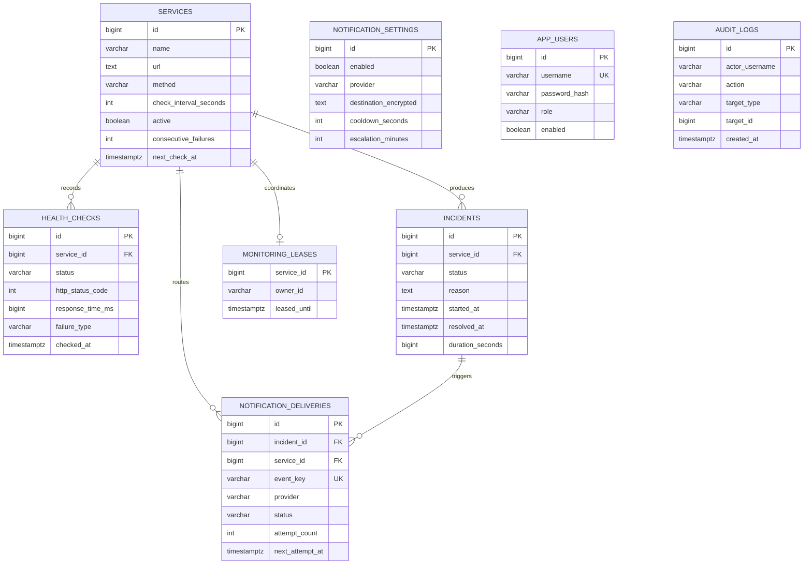
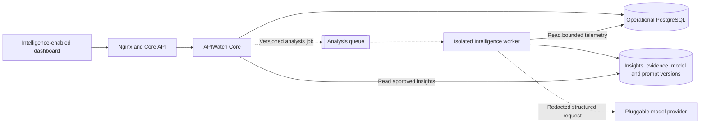

# APIWatch Project Status and Blueprint

**Audit snapshot:** 2 August 2026

**Version:** `0.1.0`

**Baseline:** merged `main` commit `4a241d7` (frontend polish Batch 8)

**Purpose:** establish what exists, what is operationally ready, what remains limited, and how APIWatch Intelligence can be added without destabilizing the monitoring core.

## Executive decision

APIWatch is complete enough to begin the first APIWatch Intelligence phase.

The core is coherent, tested, documented for operations, and already exposes the durable telemetry and incident lifecycle that an Intelligence layer needs. The recommended interpretation of “complete” is important:

- **Ready now:** controlled single-organization deployment, continued hardening, and an asynchronous Intelligence foundation.
- **Not claimed:** multi-tenant SaaS readiness, enterprise IAM, hyperscale execution, or hands-off managed-cloud operations.
- **Non-negotiable boundary:** model inference must not run synchronously inside health checks, incident state transitions, notification delivery, or readiness probes.

No core rewrite is required before Intelligence work starts. The first Intelligence batch should establish contracts, data governance, evaluation, and an asynchronous analysis path before adding user-facing AI features.

## Audit method and result

The audit reviewed application code, Flyway migrations, frontend routes and components, Docker/Compose configuration, runtime security controls, CI/CD and CodeQL workflows, dependency automation, release scripts, backup/restore procedures, and test coverage. Verification was run on the audited branch.

| Gate | Result |
| --- | --- |
| Backend unit and application integration suite | 71 tests passed |
| PostgreSQL 16 Testcontainers suite | 14 tests passed; all 11 migrations applied |
| Frontend unit suite | 9 tests passed |
| Chromium user journeys and accessibility gate | 6 tests passed |
| Frontend lint and production build | Passed |
| Docker Compose model validation | Passed |
| Repository dependency-audit policy | Passed |
| Remote CI/CD and CodeQL on baseline `4a241d7` | Passed |
| Total automated tests | 100 passed |

The intentional constraint-violation messages emitted by the PostgreSQL repository tests validate unique and foreign-key protections; they are expected and the suite passes.

The dependency policy currently carries a time-bounded exception for `GHSA-qwww-vcr4-c8h2` through 31 August 2026. The affected React Server Components action path is not present in APIWatch's static, client-rendered `BrowserRouter` application. The exception should still be removed or re-reviewed before it expires.

## Capability assessment

| Domain | State | Audit conclusion |
| --- | --- | --- |
| Service monitoring | Ready | Configurable scheduled/manual checks, durable history, bounded workers, replica-safe leases, rate-limit pauses, and SSRF validation are implemented. |
| Incident lifecycle | Ready | Threshold-based opening, one-active-incident database invariant, automatic recovery, manual resolution, and duration tracking are implemented. |
| Notifications | Ready | Six provider types, encrypted destinations, cooldown/escalation, durable outbox, atomic claims, idempotency, recovery, backoff, and manual retry are implemented. |
| Dashboard | Ready | Responsive role-aware operations experience, metrics, filtering, feedback states, forms, guarded destructive actions, and accessibility coverage are implemented. |
| Authentication | Limited-ready | Basic authentication with BCrypt-backed admin/viewer users is appropriate for a controlled deployment behind TLS; OIDC/SSO and user lifecycle are absent. |
| Authorization and audit | Ready for current scope | Read/write role separation and administrator mutation logs are present; tenant-level authorization is not. |
| Data layer | Ready | PostgreSQL, 11 ordered Flyway migrations, indexing, retention, schema constraints, and concurrency coverage are present. |
| Observability | Ready | Liveness/readiness, Prometheus, operational metrics, and request correlation are present. |
| Delivery and recovery | Ready for Compose | Hardened images, immutable tags, SBOM/provenance, backup/restore safeguards, and rollback guidance are present. No managed orchestrator is supplied. |
| Intelligence | Planned | No model integration, AI schema, prompt/version registry, evaluation harness, or AI UI exists today. |

## Current runtime blueprint

The backend deployable contains these internal modules:

- REST controllers and OpenAPI contract
- authentication, authorization, audit, validation, and secret encryption
- monitoring scheduler, database lease coordination, and bounded check workers
- incident evaluation and recovery
- notification settings, event outbox, delivery claims, and provider adapters
- dashboard metrics, Prometheus instrumentation, and history retention

These are modules, not independent network services. Keeping that distinction prevents the architecture from overstating the current deployment topology.

## Monitoring and incident sequence

## Verified data model

`APP_USERS`, `AUDIT_LOGS`, and the global `NOTIFICATION_SETTINGS` record deliberately have no database foreign-key relationships to the monitoring graph. Audit actors are stored as immutable usernames rather than user references.

## Security and trust boundaries

Implemented controls:

- all product API routes require authentication; writes require `ADMIN`
- liveness/readiness are public; OpenAPI and Prometheus require `ADMIN`
- bootstrap users are persisted with BCrypt hashes
- service authentication and custom headers, plus notification destinations, are encrypted at rest
- monitored URLs and webhooks are validated at configuration time and request time
- loopback, private, link-local, multicast, carrier-grade NAT, and related address ranges are blocked by default
- redirect following is disabled to prevent redirect-based SSRF bypass
- the production profile validates keys, credentials, HTTPS origin, CORS, and demo settings before startup
- frontend and backend containers are non-root, read-only, capability-free, and use `no-new-privileges`
- browser responses apply CSP, HSTS, frame denial, content-type, referrer, permissions, COOP, and CORP policies
- third-party GitHub Actions are pinned; dependency review, CodeQL, Dependabot, SBOM, and provenance are enabled

Residual boundaries:

- Basic authentication depends on correct external TLS termination.
- Secrets are environment/database managed; there is no KMS/Vault integration or automated rotation workflow.
- There is no tenant identifier or row-level tenant boundary.
- The two bootstrap roles are sufficient for the current product, not granular enterprise RBAC.

## Operational model

The supported deployment is Docker Compose with PostgreSQL, backend, and Nginx frontend. Ports bind to loopback by default. CI publishes matching backend/frontend images with immutable commit tags. `VERSION` is the release contract.

The repository includes verified dump/checksum backup and guarded restore scripts, an upgrade/rollback procedure, readiness-based Compose health checks, configurable retention, and operational metrics. This is a strong self-hosted baseline, but production responsibility still includes TLS, host hardening, off-host backup storage, restore rehearsals, alerting on exported metrics, and capacity planning.

## Gaps and recommendations

### Before an internet-facing enterprise rollout

1. Add OIDC/OAuth2 SSO, user lifecycle, session controls, and finer authorization.
2. Integrate a managed secret store and design encryption-key rotation with re-encryption.
3. Run a documented load/soak program covering scheduler capacity, database growth, incident storms, and provider throttling.
4. Rehearse disaster recovery with measured RPO/RTO and off-host encrypted backups.
5. Add cross-browser and visual-regression coverage for the polished dashboard.
6. Resolve or explicitly re-review the time-bounded React Router advisory exception before 31 August 2026.

### Before a multi-tenant SaaS rollout

1. Introduce an explicit tenant model and enforce it in schema, queries, authorization, audit, and metrics.
2. Define tenant quotas, isolation, retention, deletion/export, and per-tenant encryption requirements.
3. Add managed deployment infrastructure, rolling migration strategy, autoscaling, and centralized secrets/telemetry.
4. Perform a dedicated threat model and external security review.

### Product opportunities beyond the current core

- synthetic browser and multi-step checks
- SLO/error-budget policies and burn-rate alerting
- maintenance windows and alert routing policies
- public/private status pages
- agent-based checks for private networks
- richer notification routing and team ownership integration

These do not block the first Intelligence foundation, but they should be prioritized against the target customer and deployment model.

## APIWatch Intelligence target blueprint

Design principles:

- **Core remains deterministic.** Availability checks and incident state changes never depend on an AI provider.
- **Asynchronous by default.** Analysis runs after durable operational events and can be retried or disabled independently.
- **Evidence before prose.** Every insight stores the source checks/incidents, time window, transformations, model, prompt, confidence, and timestamps.
- **Structured contracts.** Model output is schema-validated and versioned before it reaches the application.
- **Least data.** Credentials, custom headers, notification destinations, and unnecessary response content never enter model prompts.
- **Provider abstraction.** The core depends on an internal analysis contract, not a vendor SDK.
- **Human control.** Early Intelligence features recommend and explain; they do not mutate monitoring configuration or resolve incidents autonomously.

## Intelligence development phases

### Phase I0 — contracts, governance, and evaluation

- choose the first narrow use case: recommended start is incident summarization with evidence links
- define analysis job, insight, evidence, feedback, prompt-version, and model-run contracts
- classify allowed/forbidden data and implement deterministic redaction
- create a frozen evaluation corpus from synthetic or sanitized incidents
- define quality, hallucination, latency, cost, and failure-mode acceptance thresholds
- add feature flags, provider timeouts, budgets, audit events, and kill switches

**Exit:** contracts and evals can be exercised without a production model dependency.

### Phase I1 — data and asynchronous foundation

- add migrations for insights, evidence references, model runs, prompt versions, and feedback
- publish versioned jobs from durable incident/check events
- implement an isolated worker and provider-neutral adapter
- add idempotency, retry/dead-letter behavior, metrics, tracing, and retention
- expose read-only insight endpoints behind administrator authorization

**Exit:** analysis can fail completely without affecting monitoring, incidents, notifications, or readiness.

### Phase I2 — incident copilot

- generate evidence-linked incident summaries and probable contributing signals
- compare the event with the service's recent baseline and related failures
- surface confidence, limitations, model/prompt version, and source telemetry
- add operator feedback and a non-AI fallback experience

**Exit:** the frozen evaluation set and a controlled operator pilot meet the approved thresholds.

### Phase I3 — anomaly and prioritization intelligence

- establish deterministic statistical baselines before model interpretation
- detect latency shifts, failure clusters, recurring patterns, and noisy alerts
- rank incidents using explicit operational features and explain the ranking
- measure precision/recall and alert-fatigue impact over time

**Exit:** Intelligence produces measurable operational value without increasing false-positive burden.

### Phase I4 — controlled recommendations and rollout

- recommend check thresholds, routing, or runbook actions with evidence
- require explicit human approval for any configuration change
- add tenant/provider policy controls if the deployment model expands
- run shadow, canary, rollback, cost, privacy, and security reviews

**Exit:** production rollout has documented ownership, budgets, observability, rollback, and governance.

## Start criteria for Intelligence

| Criterion | Current state |
| --- | --- |
| Durable health-check and incident history | Met |
| Stable database migration discipline | Met |
| Replica-safe event processing patterns | Met through leases and notification claims |
| Authentication, roles, and audit foundation | Met for single-organization scope |
| Operational metrics and request correlation | Met |
| CI, integration tests, and release discipline | Met |
| AI data contract and governance | Not started — Phase I0 |
| AI evaluation corpus and thresholds | Not started — Phase I0 |
| Asynchronous AI execution boundary | Designed, not implemented — Phase I1 |

**Recommendation:** approve Phase I0 next. Do not begin with a chatbot, direct database prompting, or synchronous LLM calls from the monitoring path.

## Blueprint artifacts

- [Editable APIWatch FigJam runtime and monitoring-flow board](https://www.figma.com/board/kvyKfGR2HGEp9SJlQT4rW9)
- [Operations runbook](operations-runbook.md)
- [Root project guide](../README.md)
- OpenAPI contract at `/v3/api-docs` on a running administrator-authenticated instance
